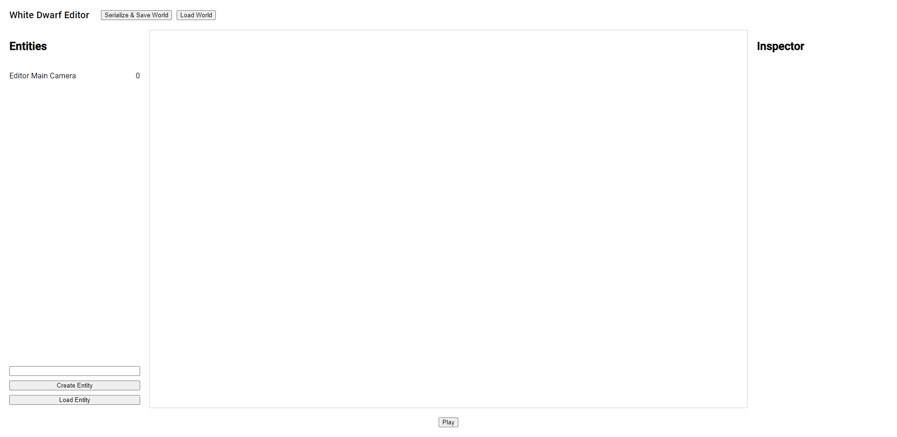
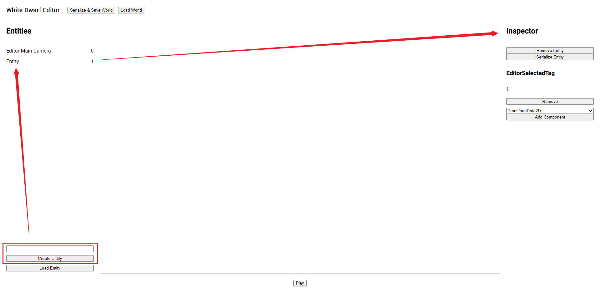
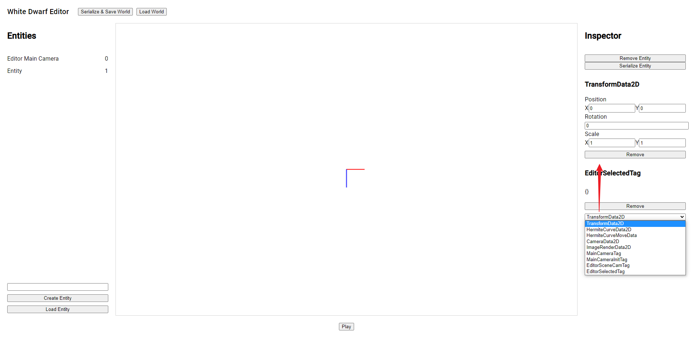
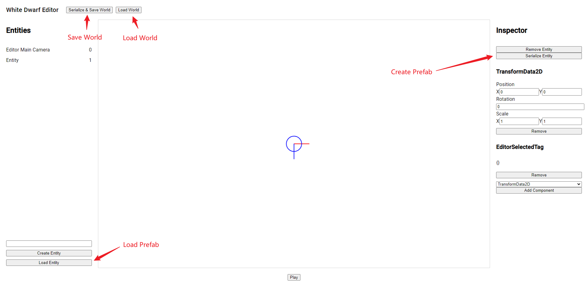
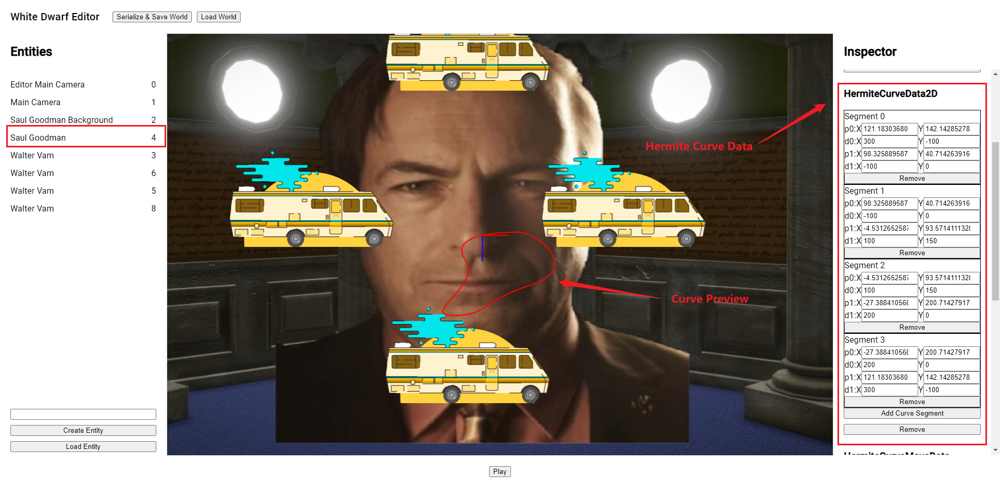

# White Dwarf

White Dwarf is a data oriented game engine based on a modified version of [ECSY Framework](https://github.com/Fangjun-Zhou/ecsy)

## Install

### Clone GitHub Repository

Clone this repository to your project as a submodule, create a `release.html` as release version of your game.

Copy `dist/editor.html` to your output directory.

Create `src/editor.ts`, `src/index.ts`, `src/release.ts` as entry points.

Then config the `package.json` with 3 more tasks:

```json
"scripts": {
    "build": "esbuild src/index.ts --bundle --outfile=dist/release.js",
    "watch-editor": "esbuild src/editor.ts --bundle --sourcemap --outfile=dist/editor.js --watch",
    "watch-release": "esbuild src/release.ts --bundle --sourcemap --outfile=dist/release.js --watch"
}
```

You can config output canvas in `release.ts` by:

```ts
// Setup main canvas.
coreRenderContext.mainCanvas = document.getElementById(
  "mainCanvas"
) as HTMLCanvasElement;
```

Details will be covered latter.

## White Dwarf Editor



### Basics

The white dwarf editor contains 3 working spaces: world editor, entity list, and entity inspector.

**Right Click** to move around. **Scroll** to zoom in and out. **Left Click** to select an entity from the entity list or the world editor.

**Notice that `Editor Main Camera` is shown in the entity list, but it will not be instantiated in release mode.**

Click `Play` to switch from release preview and editor mode.

### Entity Operations

To create a new entity, enter entity name and click `Create Entity` at the bottom of entity list.



To add components, select one from the inspector component dropdown, and click `Add Component`.



**Notice that some of the components will NOT show in your editor. Components will be shown ONLY IF there are Systems using them. This is a esbuild compile issue.**

### Prefabs and World Serialization

White Dwarf supports prefabs and world serialization. To create a prefab, select an entity and click `Serialize Entity` in the inspector. This will create an entity prefab json file.

To import a prefab, click `Load Entity` at the bottom of entity list, and select a prefab json file. This will load the prefab into the scene.

To save a world, just click `Serialize & Save World` in the tool bar. To load a world, click `Load World` and choose a world json file.



### Hermite Curve Editor

One of the feature supported by White Dwarf is hermite curve editing and animation.

When a hermiet curve data component is added to an entity, a curve preview will be shown when the entity is selected.



To edit the curve, you can add and remove segments in the HermiteCurveData editor. This feature is implemented by custom editor API provided by White Dwarf. More details will be covered latter.

To apply hermite curve animation to an entity, add `HermiteCurveMoveData` component to the entity.

There are several configs you can change:

- loop: If the animation will start from begining again when animation is over.
- speed: The speed of the animation, larger means faster.
- controlRotation: If the entity transform will align with the hermite curve derivative. When true, the x axis will point towards hermite curve derivative direction.
